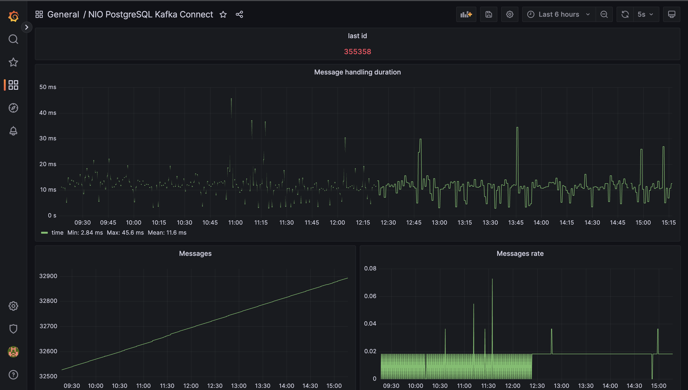

# nio-postgres-kafka-connect

## Overview

`nio-postgres-kafka-connect` is a lightweight and efficient connector designed to facilitate the seamless integration of events from PostgreSQL to Kafka using the outbox pattern. This connector is built with a focus on performance, low memory footprint, and the simplicity of connecting to a single database and Kafka instance simultaneously. Leveraging the power of the Spring framework, this project is tailored to meet the needs of developers who prefer and thrive in the Spring ecosystem.

## Features

### 1. Non-blocking Database and Kafka Connection

The connector employs non-blocking connections to both PostgreSQL and Kafka, ensuring optimal performance and responsiveness.

### 2. Low Memory Footprint

`nio-postgres-kafka-connect` is crafted with efficiency in mind, minimizing memory usage while handling large volumes of events. Only **64mb** for heap.

### 3. Single Database and Kafka Connection

Simplify your configuration by connecting to one PostgreSQL database and one Kafka instance at a time. This design choice enhances clarity and streamlines the setup process.

### 4. Support for Different Kafka Topics

Flexibility is key. The connector allows you to send events to different Kafka topics, tailoring your data distribution to your specific use case.

### 5. Deletion Policy for Old Events

Manage your event history with ease. `nio-postgres-kafka-connect` supports a deletion policy for old events, providing control over the retention of data in your Kafka topics.

### 6. Powered by the Spring Framework

Built on the robust Spring framework, this connector inherits the advantages of a widely adopted and well-documented ecosystem. Developers familiar with Spring will find the integration process seamless and intuitive.

## Getting Started

To get started with `nio-postgres-kafka-connect`, follow these simple steps:

### First of all

Run manually migration from `sql` folder to create `outbox` and `outbox_meta` tables.

### Manually

1. **Clone the Repository:**
   ```shell
   git clone https://github.com/hegemonies/nio-postgres-kafka-connect
   ```

2. **Build the Project:**
   ```shell
   cd nio-postgres-kafka-connect
   ./gradlew build
   ```

3. **Configuration:**
   Update the configuration file `application.properties` with your PostgreSQL and Kafka connection details 
   or set environments (`POSTGRES_HOST`, `POSTGRES_PORT`, `DATABASE_NAME`, `DATABASE_USERNAME`, `DATABASE_PASSWORD`, `SPRING_KAFKA_BOOTSTRAP-SERVERS`).

4. **Run the Connector:**
   ```shell
   ./gradlew bootRun
   ```

### Docker

1. **Build or clone docker image:**
   
   Build:
   ```shell
   ./gradlew jibDockerBuild
   ```
   
   Clone:   
   ```shell
   docker pull hegemonies/nio-postgres-kafka-connect:1.0.0
   ```

2. **Run docker compose:**
   
   Set up your settings in docker-compose.yml file and then run command:
   ```shell
   cd docker
   docker compose up -d
   ```

Now, you're all set to seamlessly stream events from PostgreSQL to Kafka using the outbox pattern.

## Monitoring

You can use custom grafana dashboard from `monitoring` folder. 

How dashboard looks:



## Contributing

We welcome contributions to enhance and improve `nio-postgres-kafka-connect`. Feel free to fork the repository, make your changes, and submit a pull request.

## License

This project is licensed under the [GNU Affero General Public License v3.0](LICENSE), making it open and accessible for everyone.
